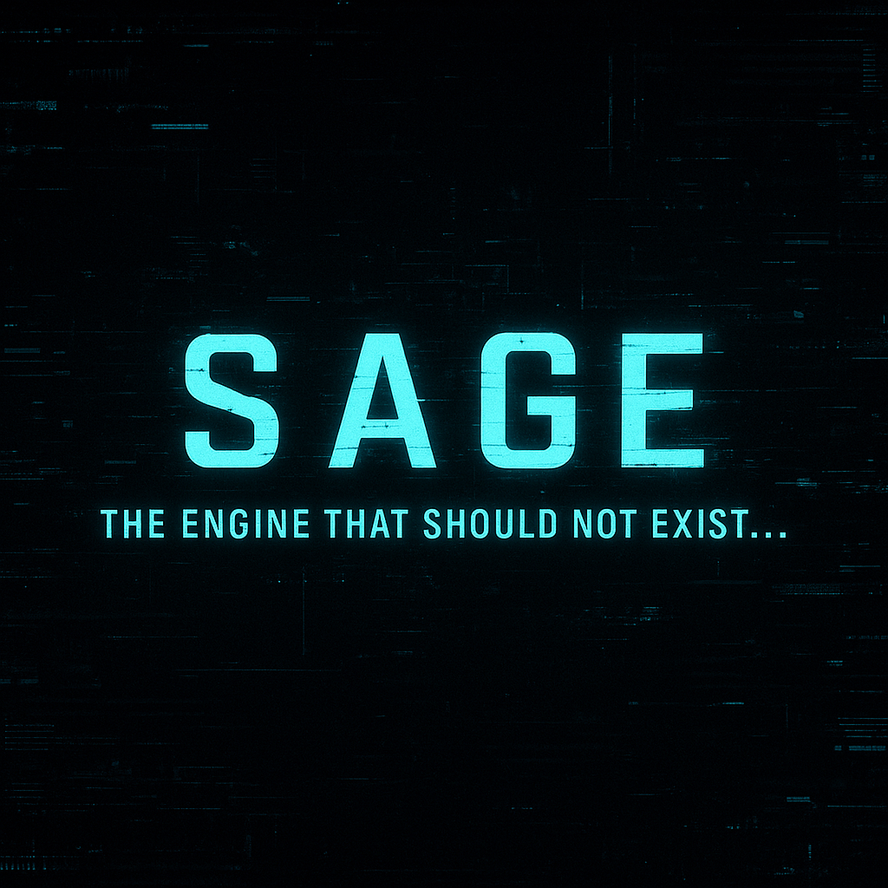

<!-- BADGES: SAGE Status & Soul -->

  
  
  
  
  
  

# STYNTHREAD ADVANCED GAME ENGINE (SAGE)

**"This engine should not exist... but I'm gonna build it anyway."**

SAGE (STYNTHREAD Advanced Game Engine) is a next-generation game engine currently in active development by **C38 ImagineWorks**.

More than an engine—SAGE is an act of reclamation, vision, and innovation. Built for devs who demand more from the systems they use, SAGE is being created from the ground up inside Unreal Engine 5 to redefine the meaning of *emotional consequence, memory-based logic,* and *player-driven immersion*.

---
<!-- CUSTOM BADGES: SAGE Flex Mode -->

  
  
  
  
  

## ⚙️ What Makes SAGE Different?

- **ThreadPrint Framework**  
  Every action leaves a mark. SAGE tracks emotional memory across player interactions, storing consequences like spiritual scars.

- **ThreadLore System**  
  Narrative memory becomes a living system that evolves based on what players *believe,* not just what they do.

- **Sensory AI**  
  Enemies don’t just react. They remember. They *adapt*. Your presence leaves an imprint.

- **Combat Rooted in Intention**  
  Inspired by FromSoftware, but layered with reactive storytelling and semi-autonomous combat logic systems.

- **Multiplatform Compatibility**  
  While in early stages, SAGE is being structured with long-term support for PC, handhelds, and MMO infrastructures in mind.

---

## 🔒 Current Status: In Development

The engine is currently in **early prototyping** and undergoing Blueprint + C++ hybrid development in Unreal Engine 5.5.4.  
This repo exists to document the journey, celebrate the breakthroughs, and honor the threads that brought us here.

📖 [Read the full Wiki](https://github.com/c38ImagineWorksDev/SAGE-ENGINE/wiki)

---

## ✊🏾 About C38 ImagineWorks

C38 ImagineWorks is an independent Black-owned studio reclaiming the soul of gaming by building what’s been missing:  
**authenticity, magic, memory, and meaning.**

---

## 📌 Follow Along

This repo will evolve as development progresses.  
Expect updates, devlogs, concept drops, and blueprint walkthroughs.

If you found this…  
Just know: **the thread chose you too.**

